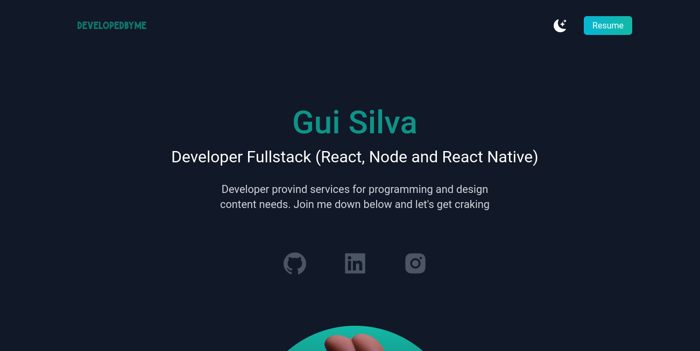
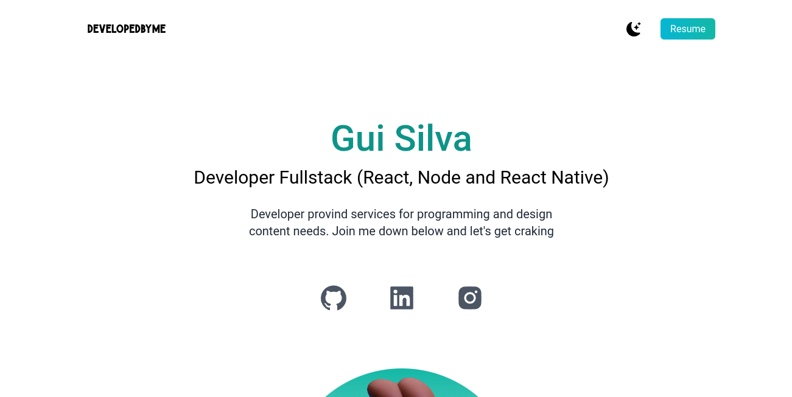

<h1 align="center">
   
</h1>

# Site Portfolio

# Screens




## Technologies used

- [NextJs](https://nextjs.org/)
- [Typescript](https://www.typescriptlang.org)
- [Tailwindcss](https://tailwindcss.com/)

## Requirements

You need to install both [Node.js](https://nodejs.org) and [Yarn](https://yarnpkg.com) or npm to run this project.

## How to use it

```bash
  # Install the dependencies
  $ yarn install
  # Run the web server
  $ yarn dev
```

The app will be available for access on your browser at (http://localhost:3000)
